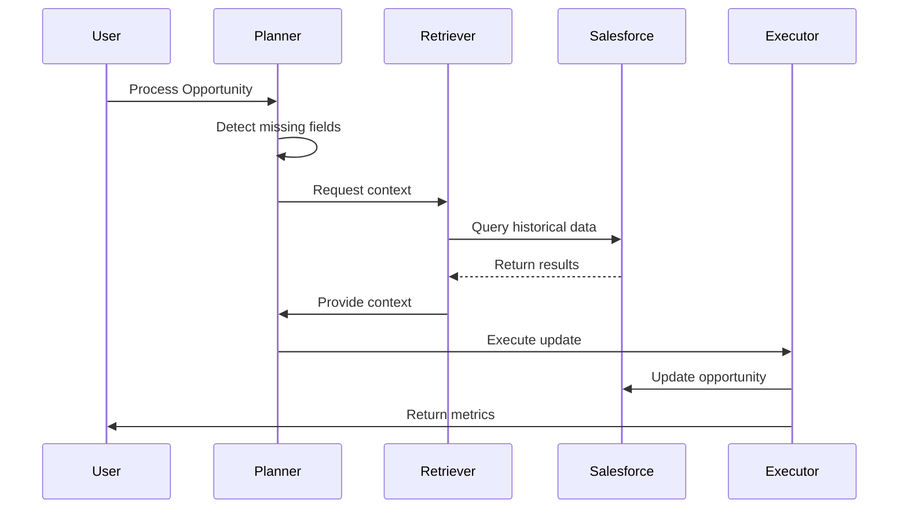

# 🤖 AgentForce CRM

## Multi-Agent AI System for Automated CRM Data Completion

### Web Application Link : **[https://agentforce-ai-crm.onrender.com](https://agentforce-ai-crm.onrender.com)**

### Created by : **Shahzada Moon**

**Team : MOON-Lab (Metadata Optimization & Orchestration Network Lab)** 

**Participation Type : Solo Participant**

🏆 Microsoft AI Unlocked 2026 — Track 4: Agent Teamwork

<div align="center">

[](https://microsoft.acehacker.com/aiunlocked/)
[](https://ai.azure.com)

[](https://salesforce.com)
[](https://python.org)

</div>

---

# 📌 Overview

**AgentForce CRM** is a **multi-agent AI system** designed to automatically detect and complete missing Salesforce CRM fields.

Instead of manual data entry, three intelligent AI agents collaborate to analyze context, retrieve historical data, and update CRM records automatically.

### The three cooperating agents

| Agent     | Role                                            |
| --------- | ----------------------------------------------- |
| Planner   | Detect missing fields and create strategy       |
| Retriever | Query Salesforce history and find similar deals |
| Executor  | Update Salesforce records and log results       |

Average system confidence: **88%**

---

# ⚠️ The Problem

CRM data quality is a major issue across organizations.

| Problem                           | Impact                         |
| --------------------------------- | ------------------------------ |
| 91% CRM data incomplete           | Poor reporting and forecasting |
| Manual entry takes 5–7 hours/week | Lost productivity              |
| 30% annual data decay             | Outdated decision making       |
| Incomplete opportunities          | Slower deal cycles             |

Example feedback from sales teams:

> “I spend more time updating CRM than actually selling.”

---

# 💡 Solution

AgentForce CRM automatically fills missing CRM fields by combining reasoning, retrieval, and execution.

Workflow:

1️⃣ Detect missing fields

2️⃣ Retrieve historical opportunity data

3️⃣ Analyze similar deals

4️⃣ Infer likely field values

5️⃣ Update Salesforce records

6️⃣ Log audit trail and metrics

---

# 🎥 Demo

Run the demo locally:

```bash
python demo.py
```

Example output:

```
Processing Opportunity: OPP-001

Planner: Missing fields detected
Retriever: Retrieved historical opportunities
Executor: Updated Salesforce record

Fields completed: 3
Time saved: 45 minutes
Confidence: 88%
```

---

# 🏗 System Architecture


---

# Main WorkFlow


---

# Step-By-Step User WorkFlow


---

# 🔄 Agent Communication



---

# 🔷 Salesforce Integration

The system connects to Salesforce using a **Connected App and OAuth2 authentication**.

Example connection code:

```python
from simple_salesforce import Salesforce
import os

sf = Salesforce(
    username=os.getenv("SF_USERNAME"),
    password=os.getenv("SF_PASSWORD") + os.getenv("SF_SECURITY_TOKEN"),
    domain="test"
)

accounts = sf.query("SELECT Id FROM Account")
print(f"Connected! {len(accounts['records'])} accounts found")
```

---

# 🛠 Technology Stack

| Layer           | Technology                  |
| --------------- | --------------------------- |
| AI Models       | Phi-4-reasoning, Phi-4-mini |
| Platform        | Azure AI Foundry            |
| API Layer       | Azure OpenAI SDK            |
| Backend         | Python                      |
| CRM Integration | Salesforce API              |
| Deployment      | Docker Ready                |

---

# 🔷 Microsoft Technologies Used

1️⃣ Azure AI Foundry
2️⃣ Phi-4-reasoning model
3️⃣ Phi-4-mini-instruct model
4️⃣ Azure OpenAI SDK
5️⃣ Azure AI Content Safety

---

# 📦 Installation

Clone the repository:

```bash
git clone https://github.com/23f2002668/agentforce-crm.git
cd agentforce-crm
```

Create virtual environment:

```bash
python -m venv venv
source venv/bin/activate
```

Install dependencies:

```bash
pip install -r requirements.txt
```

---

# ⚙ Environment Configuration

Create `.env`

```
AZURE_FOUNDRY_ENDPOINT=
AZURE_FOUNDRY_API_KEY=

PLANNER_MODEL=Phi-4-reasoning
RETRIEVER_MODEL=Phi-4-mini-instruct
EXECUTOR_MODEL=Phi-4-mini-instruct

SF_USERNAME=
SF_PASSWORD=
SF_SECURITY_TOKEN=
SF_DOMAIN=test
SF_CONSUMER_KEY=
SF_CONSUMER_SECRET=
```

---

# 📁 Project Structure

```
AGENTFORCE-CRM/
│
├── 📄 .env                               # Environment variables (Azure + Salesforce credentials)
├── 📄 .gitignore                         # Git ignore file
├── 📄 README.md                          # Project documentation
├── 📄 requirements.txt                   # Python dependencies
├── 📄 Procfile                           # Render deployment configuration
├── 📄 render.yaml                        # Render blueprint configuration (optional)
│
├── 📄 app.py                             # Main orchestrator with AgentForceCRM class
├── 📄 demo.py                            # CLI demo script
├── 📄 config.py                          # Configuration management
├── 📄 test_sf.py                         # Salesforce connection test
│
├── 📄 web_app.py                         # 🌐 PROFESSIONAL FLASK WEB APPLICATION
│
├── 📁 agents/                            # Agent modules
│   ├── 📄 __init__.py
│   ├── 📄 planner.py                     # Planner Agent logic
│   ├── 📄 retriever.py                   # Retriever Agent logic
│   └── 📄 executor.py                    # Executor Agent logic
│
├── 📁 tools/                             # Utility modules
│   ├── 📄 __init__.py
│   └── 📄 salesforce_client.py           # Salesforce API client with OAuth2
│
└── 📁 data/                              # Sample data (optional)
    └── 📄 sample_data.csv                # Sample accounts for Salesforce import
```

---

# 📊 Performance Metrics

| Metric                 | Value             |
| ---------------------- | ----------------- |
| Fields completed       | 3 per opportunity |
| Time saved             | 45 minutes        |
| Confidence             | 88%               |
| Similar deals analyzed | 10+               |
| Workflow steps         | 15                |

---

# 💼 Business Impact

Example for **100 sales representatives**

| Metric             | Value                |
| ------------------ | -------------------- |
| Daily time saved   | 75 hours             |
| Annual hours saved | 18,750               |
| Estimated value    | ₹1.87 Crore per year |

---

# 👤 Author

**Shahzada Moon**

Bachelor of Science (B.S.) Data Science And Applications from [Indian Institute of Technology Madras](https://study.iitm.ac.in/ds/)

B.Tech (Computer Science & Engineering) from [Dr. A. P. J. Abdul Kalam Technical University](https://aktu.ac.in)

**GitHub :** [https://github.com/23f2002668](https://github.com/23f2002668)

**Portfolio :** [https://23f2002668.github.io/Portfolio/](https://23f2002668.github.io/Portfolio/)

**Email :** [23f2002668@ds.study.iitm.ac.in](mailto:23f2002668@ds.study.iitm.ac.in)

**Location :** Ghaziabad, Uttar Pradesh, India

---

# ⭐ Final Status

| Requirement            | Status |
| ---------------------- | ------ |
| Three Agents           | ✅      |
| Salesforce Integration | ✅      |
| Demo Working           | ✅      |
| Performance Metrics    | ✅      |
| README Complete        | ✅      |

---

**Built using Microsoft Azure AI + Salesforce APIs**

---

⭐ If you like this project, please consider starring the repository.
